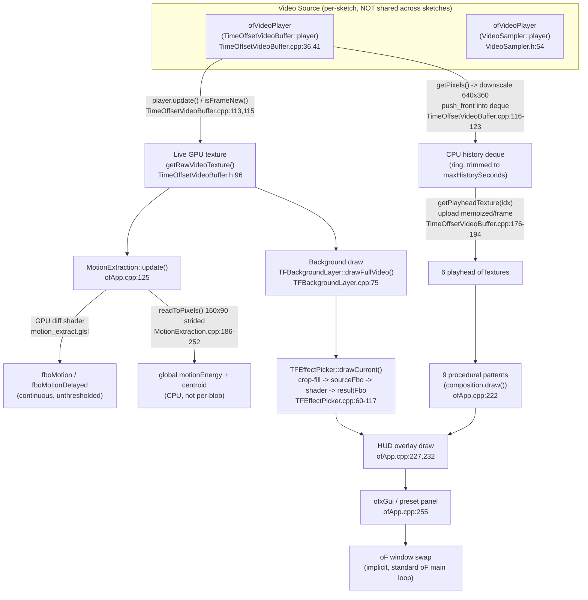

# Exploratory Codebase Probe: Blob-Driven Video Fragments and Foreground-Masked Effects

**Scope note:** The codebase investigated is `apps/myApps/EcopunkVideoCollage` inside the openFrameworks monorepo checkout at `/Users/joseconchello/openFrameworks`. This app has a `shared/src` library plus six independent "sketches" under `sketches/*` (blueprint_emergence, temporal-fields, fragment-trail, quadrant-crosshair, radar-pulse, radar-effects-gallery), each with its own `ofApp`. The sibling app `FireplaceWaterfall` (separate git repo under `apps/myApps/`) was checked only for its `WebControl` module as an external pattern reference — it is not part of this codebase and is not integrated with EcopunkVideoCollage. All file paths below are relative to `apps/myApps/EcopunkVideoCollage/` unless stated otherwise. This is a research artifact only; **no production code was modified**.

---

## 1. Executive Summary

Both proposed features are compatible with the existing architecture, but neither has a ready-made home — they sit across three subsystems (`Fragment`/`CompositionBase`, `ShaderLibrary`, `TimeOffsetVideoBuffer`/`MotionExtraction`) that were each built independently, per-sketch, and never unified. There is **no blob detection and no usable mask** anywhere in the app today.

**Strongest reusable systems:**
- `Fragment` (`shared/src/Fragment.h/.cpp`) already does exactly the texture-sharing part of blob fragments: N instances hold a non-owning `const ofTexture*` into one shared video texture plus a pixel-space crop rect, drawn via `ofTexture::drawSubsection` with zero CPU copies (`Fragment.cpp:38-41,186-191`).
- The **per-fragment-local-FBO effect pattern** in `BEFragment::drawOverlay()` (`sketches/blueprint_emergence/src/BEFragment.cpp:303-387`) is the correct, resolution-safe way to apply one shader to one fragment's crop — it renders the crop into a fragment-sized FBO first so the shader sees clean local 0–1 UVs, unlike `Quadrant.cpp:276`, which incorrectly passes full-window `resolution` to a quarter-screen effect.
- `MotionExtraction`'s frame-diff shader (`shared/src/MotionExtraction.cpp`, `bin/data/shaders/motion_extract.glsl`) is the closest thing to a mask source, but its output is continuous and unthresholded — it is a pattern to extend, not a mask to consume as-is.
- `TFPlayheadAssignment.h` already solves "N independent objects, each wanting its own temporal offset, sharing a small pool of GPU playheads" — directly transferable to per-fragment temporal offsets for blob fragments.

**Biggest architectural gaps:**
- No blob detection, no contour/connected-component logic, no thresholding-into-mask logic anywhere (`ofxOpenCv` exists in the framework's `addons/` but is referenced by zero `addons.make` file in this app; `ofxCv` doesn't exist in this checkout at all).
- No bounds smoothing anywhere on `Fragment` — bounds are set once at placement and never reassigned (`Fragment.h:73` — no setter exists). Blob-driven bounds changing every frame/every-other-frame will need new smoothing logic.
- Three independent, drifting copies of `ShaderLibrary` exist (`shared/src`, `quadrant-crosshair/src`, `fragment-trail/src`) and no single effect coordinator — each sketch reinvents effect-slot cycling (`BEFragment`, `Quadrant`/`QuadrantManager`, `FTFragmentPool`/`FTModeController`, `TFEffectPicker`). A naive implementation risks becoming a fifth parallel copy.
- Two independent temporal/history implementations already exist (CPU `ofPixels` deque in `TimeOffsetVideoBuffer` vs. GPU `ofFbo` ring buffer inside `MotionExtraction`) that don't share state — a third one must not be added.

**Recommended V1 approach, in one line each:**
- *Blob fragments:* new lightweight CPU blob tracker (ofxOpenCv, ~320×180, every-other-frame) feeding stable rectangles + persistent int IDs into a small pool of `Fragment`-derived objects that reuse the shared `ShaderLibrary` and the `BEFragment`-style local-FBO effect pattern — no new video decode, no per-fragment pixel copies.
- *Foreground-masked effects:* extend `MotionExtraction`'s diff shader with a `smoothstep()` threshold + separable blur to produce one low-res (e.g. 320×180) feathered mask texture, upscaled and sampled in a single new composite shader pass that mixes original vs. effected video by mask alpha — one full-screen draw, no second effected-video render unless the effect itself needs its own pass.

**Main Raspberry Pi 3B+ risks:** CPU pixel readback for blob analysis (must be small and infrequent — the existing `MotionExtraction::sampleControlValues()` 160×90 strided readback is the right order of magnitude to imitate, not the full-resolution `readToPixels()` calls elsewhere); allocating a genuinely new `ofVideoPlayer` for analysis (must not happen — reuse the existing decoded texture/pixels); and the two existing per-sketch `ShaderLibrary` forks plus `resolution`-uniform bugs (`Quadrant.cpp:276`) meaning any new per-fragment effect code must copy `BEFragment`'s local-FBO pattern, not `Quadrant`'s.

---

## 2. Current Video and Effect Architecture

Traced end-to-end through `sketches/temporal-fields` (clearest `setup()`/`update()`/`draw()` separation) and cross-checked against `sketches/blueprint_emergence`:

Key structural facts (all confirmed by direct read, not inference):
- **No shared decode across sketches.** `TimeOffsetVideoBuffer` and `VideoSampler` each own an independent `ofVideoPlayer`; no sketch currently uses both against the same source, so no double-decode is *currently* happening, but nothing in either class prevents it if a future feature naively combined them.
- **Single live texture, multiple GPU consumers, zero redundant uploads.** Both the background draw and `MotionExtraction` read the same `getRawVideoTexture()` pointer once per frame.
- **New-frame detection is polling, not eventing.** Every consumer calls `player.isFrameNew()` itself (`TimeOffsetVideoBuffer.cpp:115`, `VideoSampler.cpp:77`, three more call sites in quadrant-crosshair) — there is no `ofEvent`/listener hook to tap into centrally.
- **Always crop-to-fill, never letterboxed.** `tfComputeCropFillSrcRect()` (`TFTextureCropFill.h:13-28`) computes a centered "cover" crop; this affects blob-coordinate mapping (see Risks §10).
- **FBOs are allocate-on-first-use/size-change everywhere observed** (`TFEffectPicker.cpp:73-82`, `TFComposition.cpp:81-88`, `ErosionFBO.cpp:16`, `MotionExtraction.cpp:12-13` allocated once in `setup()`), never reallocated unconditionally per frame. This is already Pi-safe house style — imitate it.

---

## 3. Reusable Infrastructure Inventory

| System / Class | File Paths | Current Responsibility | Reuse Rating | Proposed Use | Risks |
|---|---|---|---|---|---|
| `Fragment` | `shared/src/Fragment.h/.cpp` | Base class: shared non-owning texture pointer + pixel-space crop rect, drawn via `ofTexture::drawSubsection`; sinusoidal drift; static shared shader for a legacy desaturate/circle effect | **Directly reusable** | Base class for `BlobFragment` | No bounds mutator exists (`.h:73`) — must add one; no rotation field |
| `CompositionBase` | `shared/src/CompositionBase.h/.cpp` | Owns `vector<unique_ptr<Fragment>>`, BLANK→PLACEMENT→DENSITY→DISSOLVE cycle, hard `maxFragments` cap | **Reusable with a small adapter** | Not its state machine (blob fragments are continuously-driven, not cycle-driven) but its ownership/cap pattern is worth copying | Its cycle model doesn't fit a continuously-tracked blob population; don't force-fit |
| `ShaderLibrary` (shared) | `shared/src/ShaderLibrary.h/.cpp` | Name→`ofShader` map, 17 effects loaded against one shared `vert.glsl` | **Directly reusable** | Effect source for blob-fragment shaders and the mask-composite shader | Two other forks exist (`quadrant-crosshair/src/ShaderLibrary.*`, `fragment-trail/src/ShaderLibrary.*`) — use the `shared/src` one only, do not create a 4th copy |
| `BEFragment::drawOverlay()` pattern | `sketches/blueprint_emergence/src/BEFragment.cpp:303-387` | Renders a fragment's crop into a fragment-local FBO first, then applies shader in clean local UV space | **Reusable as a pattern** (not a class to inherit — it's sketch-local) | Copy this local-FBO approach for blob-fragment effects; do NOT copy `Quadrant.cpp:276`'s full-window-resolution-on-a-subrect approach | Needs porting into `shared/src` to avoid a 3rd duplicate implementation |
| `VideoSampler` | `shared/src/VideoSampler.h/.cpp` | Seek-based single-frame capture, own `ofVideoPlayer` | **Not suitable as blob-fragment video source** (separate decode) | N/A for background/fragment texture; only relevant if analysis needs an independent still capture | Owns its own decode — do not pair with `TimeOffsetVideoBuffer` on the same source |
| `TimeOffsetVideoBuffer` | `shared/src/TimeOffsetVideoBuffer.h/.cpp` | CPU `deque<ofPixels>` history (640×360 downscaled), 6-playhead pool, `getRawVideoTexture()` for live frame | **Directly reusable** for the live texture; **reusable with adapter** for temporal blob-fragment offsets | Source of the shared live GPU texture for background + blob analysis input; playhead pool reusable for temporal-offset fragments later | Playhead pool is only 6 deep — a target of 6–12 concurrent blob fragments each wanting a distinct offset would exhaust it (see Risks §10) |
| `TFPlayheadAssignment.h` | `sketches/temporal-fields/src/TFPlayheadAssignment.h:20-64` | Assigns/shares a small playhead pool across many fragments by nearest-offset matching | **Reusable as a pattern** | Directly transferable algorithm for "many blob fragments, few temporal playheads" | Sketch-local; needs promotion to `shared/src` to reuse cleanly |
| `MotionExtraction` | `shared/src/MotionExtraction.h/.cpp`, `bin/data/shaders/motion_extract.glsl` | GPU frame-diff at 160×90 (accum) / up to 640×360 (extract); continuous, unthresholded, unfeathered "motion glow"; cheap strided CPU readback for one global energy scalar + centroid | **Reusable with a small adapter** | Extend with threshold + blur to become the foreground-mask source | Currently RGB not alpha (`.cpp:8,31`); no coordinate mapping back to full video resolution documented; must add both |
| `TFPatternBlobGrid`'s metaball masking math | `sketches/temporal-fields/src/TFPatternBlobGrid.cpp:27,187-198` | Inverse-square procedural field → `MASK_COVERAGE_THRESHOLD` → soft alpha mask (no image input — purely kinematic) | **Reusable only as a pattern** | The threshold→soft-falloff technique is exactly what `MotionExtraction`'s raw magnitude output needs to become a feathered mask | Not CV — do not mistake this for real blob detection (see §7) |
| `ErosionFBO` / `RPRevealMask` | `shared/src/ErosionFBO.h/.cpp`, `sketches/radar-pulse/src/RPRevealMask.h/.cpp` | Generic ping-pong capture→decay-blend→present FBO wrapper | **Reusable as a pattern** | Reference implementation for any new ping-pong buffer needed by mask cleanup | Not required for V1 mask (single-pass threshold+blur suffices) |
| `ContourWidget` | `shared/src/hud/ContourWidget/ContourWidget.h/.cpp` | Decorative Perlin-noise HUD line art — **no image input at all** | **Not suitable** | N/A | Do not reuse — it is not contour detection despite the name |
| `ofxOpenCv` | `/Users/joseconchello/openFrameworks/addons/ofxOpenCv` (framework-level, not app-level) | Available in the framework checkout but referenced by **zero** `addons.make` in this app | **Reusable with a small adapter** (needs to be added to a sketch's `addons.make`) | Candidate library for background subtraction + `findContours`/bounding-rect blob extraction | Not currently linked into this app at all — must be added; `ofxCv` does not exist in this checkout |
| `TFParameterPanel` preset system | `sketches/temporal-fields/src/TFParameterPanel.h/.cpp` | Real JSON preset save/load (`ofSavePrettyJson`/`ofLoadJson`) over `ofParameterGroup`s | **Reusable only as a pattern** | Reference for how a future blob/mask parameter preset system would serialize | Hard-coded to temporal-fields, not shared/generic |
| FireplaceWaterfall `WebControl`/`WebParamBindings` | `../FireplaceWaterfall/src/WebControl/*` (sibling app, separate repo) | Bespoke web parameter binding tied to FireplaceWaterfall's own `ControlRouter`/`ControlPanel` | **Reusable only as a pattern** | Reference only if/when a web UI is added to EcopunkVideoCollage | Not integrated with this app; EcopunkVideoCollage has **no** web-parameter system today (confirmed by exhaustive grep, zero hits) |
| `FTFragmentPool` | `sketches/fragment-trail/src/FTFragmentPool.h/.cpp` | `vector<FTFragment>` population with spawn throttle + hard-cap eviction from the front; `maxFragments` default 18 | **Reusable as a pattern** | Closest existing example of a capped, continuously-spawning fragment population (vs. `CompositionBase`'s cycle-based model) | `FTFragment` deliberately avoids `drawSubsection` + shader combo due to a documented UV bug with `vert.glsl` (`FTFragment.cpp:33-40`) — verify before combining crop+shader for blob fragments |

---

## 4. Shader and Effect Findings

**Existing effect contract — two incompatible conventions coexist:**
1. *"Effects pool" shaders* (`shaders/effects/*.glsl`, loaded by `ShaderLibrary`): `#version 120`, `uniform sampler2D tex;`, `varying vec2 vTexCoord` (set by the shared `vert.glsl` from `gl_MultiTexCoord0.xy`), always `uniform float alpha;`, output convention `gl_FragColor = vec4(mix(original, effect, alpha), alpha)` — alpha is baked into the blend math itself, not just output alpha.
2. *Fragment/erosion family* (`shared/src/shaders/*.frag`): `sampler2D tex0`, `varying vec2 texCoordVarying` (different varying name), no `alpha` uniform — opacity is handled in C++ via `ofSetColor(255, opacity*255)` before drawing (`Fragment.cpp:178`).

Call sites paper over the split by binding **both** uniform names (`sh.setUniformTexture("tex", ...); sh.setUniformTexture("tex0", ...)`, `Quadrant.cpp:274-275`, `BEFragment.cpp:364-365`) plus a `resolution` uniform. This is fragile duplication, not a real unification — any new effect contract for blob fragments/masks should pick **one** convention (recommend the effects-pool convention, since it already has an `alpha` uniform, which the mask-composite pass needs) and not add a third.

**Mask/alpha/threshold/blend support found:**
- Alpha compositing baked into every effects-pool shader via `mix(original, effect, alpha)`.
- A dedicated `threshold.glsl` (`step(threshold, luma)`) exists but is a stylistic posterize effect, not a foreground/background mask.
- A circular-crop mesh (`Fragment::drawTexturedCircleMesh()`, `Fragment.cpp:195-232`) replaced an earlier, buggy `gl_FragCoord`-based shader mask (comment at `Fragment.cpp:164-171` explains the old approach "could discard every pixel"). This is real evidence that **non-rectangular masking via shader-space discard is fragile here**; the working replacement uses a hand-built triangle-fan mesh with per-vertex texcoords, not a shader mask — a data point against attempting contour-shaped masking via fragment shader discard for V1.
- Real blend-mode selection exists: `TFAmbientTextureLayer.cpp:144-175` switches `OF_BLENDMODE_SCREEN/MULTIPLY/ALPHA` with a compensating shader; `RPRevealMask.cpp:90-116` does raw `GL_MAX` blend-equation ping-pong compositing.

**Multi-pass support:** Confirmed multi-texture-input single pass exists twice already — `MotionExtraction::updateExtract()` binds `currentFrame`, `delayedFrame`, and `accumFrame` simultaneously (`MotionExtraction.cpp:111-113`), and `TFFragmentTransition::draw()` binds `fromTex`/`toTex` for a dissolve (`TFFragmentTransition.cpp:89-90`). This is directly the precedent needed for a mask-composite shader that takes `videoTex` + `maskTex` (+ optionally an effected-video texture) in one draw call.

**Per-fragment suitability:** `BEFragment`'s local-FBO pattern (render crop into a fragment-sized FBO, then run the effect shader in clean 0–1 local UV space, `BEFragment.cpp:340-347` comment) is resolution-correct and directly reusable. `Quadrant.cpp:276` is the anti-pattern to avoid — it passes full-window `resolution` to an effect that only covers a quarter of the screen.

**Lightweight effect candidates for Pi 3B+:** the effects-pool shaders are single-pass, no loops beyond fixed small kernels, operating on whatever-size FBO they're given — `desaturate`, `hue_rotate`, `threshold`/posterize, and the erosion/reveal ping-pong shaders are all reasonable single-pass costs at fragment-sized resolution (a handful of 100–300px FBOs, not full 1920×1080).

---

## 5. Fragment Video Player Findings

**Data model** (`Fragment`, `shared/src/Fragment.h`): `bounds`(`ofRectangle`), `videoTexture`(`const ofTexture*`, non-owning), `videoCrop`(`ofRectangle`, **pixel-space**, not normalized UV), `opacity`(float), `state`(enum `ARRIVING/STABLE/DRIFTING/DISSOLVING/GHOST/DEAD`), drift params (`driftOffset/driftAmp/driftFreq`), `id`(int, externally assigned), one **static, class-shared** `ofShader fragmentShader`. No rotation, no per-instance shader, no lifespan scalar (lifetime is phase/state-driven).

**Crop/UV mechanism:** Zero pixel copies. `setVideoSource(&texture, cropRect)` stores a pointer + pixel-space rect (`Fragment.cpp:38-41`, comment: "No copying. The texture updates automatically as the player advances."). Drawing uses `ofTexture::drawSubsection(dstX,dstY,dstW,dstH, cropX,cropY,cropW,cropH)` (`Fragment.cpp:186-191`) — the crop rect is computed once at placement by `BEComposition::requestVideoTexture()` (`BEComposition.cpp:846-880`), matching the fragment's destination aspect ratio against a random pixel offset into the live video frame. This confirms the crop coordinate system is **pixel-space against source video resolution**, computed at the call site, not inside `Fragment` itself — a blob tracker's normalized/pixel bounding boxes can feed this same path directly.

**Lifecycle:** `CompositionBase` owns `vector<unique_ptr<Fragment>>`; every placement does `make_unique<BEFragment>()` + `push_back` — **new heap allocation per fragment, no object pool**. `fragments.clear()` wipes everything each BLANK cycle. `maxFragments` is a hard cap enforced before placement (`BESettings.h` current value `4`, some presets `18`). `sketches/fragment-trail`'s separate, non-`Fragment`-derived `FTFragmentPool` is the closest thing to true population management: `vector<FTFragment>` value type with hard-cap eviction from the front, default `maxFragments = 18` (`FTFragmentPool.h:69`) — still allocates a new object per spawn, not object reuse, but the cap/evict pattern is worth copying for a blob-fragment pool sized to the 6–12 target.

**Effect integration:** Not built into base `Fragment` beyond a single static legacy shader. `BEFragment` layers its own effect-slot state machine on top, pulling named shaders from a `ShaderLibrary*` (see §4). A blob fragment would need the same kind of per-instance effect-slot field added — `Fragment` itself has no such field today.

**Allocation behavior:** No per-fragment FBO exists in base `Fragment` (it draws directly via `drawSubsection`). `BEFragment::drawOverlay()` *does* allocate a per-fragment-local FBO pair (`effectSourceFbo`/`effectResultFbo`) sized to the fragment's own bounds, guarded by the standard allocate-on-size-change check — this is the one place in the current codebase closest to "per-fragment FBO," and the target architecture's constraint ("prefer no per-fragment FBOs") should be weighed against it: with only 4–18 fragments and small (typically <300px) crop sizes, this has worked in practice on the existing sketches, but for a strict Pi budget, a shared scratch FBO reused sequentially across fragments (draw fragment N into it, apply effect, composite, move to fragment N+1) is a safer V1 choice than N persistent per-fragment FBOs.

**Suitability for blob-driven bounds:** Mechanically ready (shared texture, arbitrary pixel-space rect, `drawSubsection`, zero copies) but **`Fragment::bounds` and `videoCrop` are never reassigned after `setup()`** — no setter exists (`Fragment.h:73` only exposes `getBounds()`). This is the single largest gap: rapidly-changing blob bounding boxes need a new `updateBounds()`/`updateCrop()` path plus frame-to-frame smoothing (lerp/spring), neither of which exists anywhere in the current fragment or grid code (confirmed: the only `ofLerp` calls in `shared/src` are unrelated color-alpha and random-position-pick uses).

**Texture orientation:** No confirmed Y-flip bug in the video-crop path; `fragmentEffects.vert` passes `gl_MultiTexCoord0` through unmodified. The one `flipY` found (`RidgelineRenderer`) is an unrelated stylistic mirror for line-art rendering, not a video-orientation correction.

**Should NOT be reused as-is:** `Quadrant`'s scissor-clip approach (draws the *full* video texture oversized and clips with `glScissor`, explicitly avoiding `drawSubsection` due to a documented shader/`vert.glsl` UV-combination bug, `FTFragment.cpp:33-40`) — this is evidence that combining `drawSubsection`-style cropping with certain shaders has caused a real bug in this codebase; the effect application must be validated against actual crop rects before reuse, not assumed safe by analogy to `BEFragment`.

---

## 6. Temporal Fragment Findings

**History ownership:** Single-instance-per-app, centralized. `ofApp` owns one `TimeOffsetVideoBuffer` (`sketches/temporal-fields/src/ofApp.h:58`); all consumers (9 procedural patterns, background layer, transitions) receive a pointer/reference to the same instance — no per-consumer copies. `sketches/fragment-trail` has its own **byte-identical vendored fork** of the same class rather than including `shared/src`'s copy — same duplication risk pattern as `ShaderLibrary`.

**Storage strategy:** CPU RAM, `std::deque<ofPixels>`, frames downscaled to 640×360 before storage. Capacity = `maxHistorySeconds × assumedSourceFps` (both configurable; header default 10s×24fps=240 frames ≈162–216MB, temporal-fields' actual runtime override is 3s×24fps=72 frames ≈48.6–64.8MB). GPU upload only happens for the ≤6 playheads actually in use, memoized once per frame per playhead (`uploadedThisFrame` flag). The class header itself documents the Pi 3B RAM constraint as the reason this design (CPU-resident, not a texture-per-frame) was chosen (`TimeOffsetVideoBuffer.h:26-29`).

**Delay selection:** No direct `getFrameAtOffset(seconds)` API. Instead, a 6-slot "playhead" pool addressed by index: `jumpPlayhead(idx, normalizedOffset[0,1])` / `rampPlayheadTo(idx, offset, unitsPerSecond)`, then `getPlayheadTexture(idx)`. `TFPlayheadAssignment.h:20-64` assigns/shares this pool across many fragments by nearest-desired-offset matching with graceful fallback when the pool is exhausted — already load-bearing in temporal-fields (fragments routinely get independent offsets from spatially-varying Perlin noise).

**Memory/performance cost:** See above — tens to ~200MB CPU RAM depending on configured history length; GPU cost is bounded to 6 live playhead textures at 640×360, not the full history.

**Reuse path for blob fragments:** Directly transferable pattern (not code, since it's sketch-local): give each blob fragment a `playheadIndex` into the same shared pool via the same nearest-offset-assignment algorithm as `TFPlayheadAssignment`. The **sizing risk** is real: the pool is only 6 deep, and the target blob-fragment count is 6–12 — if temporal offset is layered onto blob fragments in addition to visual variety, offset collisions/pool exhaustion become likely and should be explicitly tested, not assumed away.

**Separate/second temporal system — do not conflate:** `MotionExtraction` independently implements its own GPU `vector<ofFbo>` ring buffer (`frameHistory`, `MAX_HISTORY_FRAMES` = 60 desktop / 15 Pi, at 160×90) plus a separate ping-pong accumulation pair (`fboAccumA/B`, `motion_accum.glsl` decay blend) — this is a **second, independent implementation of "give me N frames ago"** that doesn't share state with `TimeOffsetVideoBuffer`'s CPU deque. Both already coexist in temporal-fields without conflict because they serve different purposes (visual playback offset vs. motion diff), but a new temporal feature must pick one existing pattern to extend, not invent a third.

**Current + delayed simultaneously:** Already proven twice (`MotionExtraction.cpp:111-113` binds current+delayed+accum in one pass; `TFFragmentTransition.cpp:89-90` binds two playhead textures in one pass) — directly reusable precedent for a blob-fragment shader wanting both a current-frame crop and a delayed-frame crop.

**Loop/seek/pause robustness:** Loop wrap has no special-case reset (history just keeps accumulating relative frames, which is fine for a relative-offset buffer). Source change explicitly clears history (`advanceToNextMedia()` → `history.clear()`, `.cpp:78`). The buffer **never seeks** by design. Pause handling is **UNKNOWN/not found** — no explicit pause-aware code exists; behavior under a paused player was not exercised in any traced code path.

---

## 7. Blob/Mask/CV Findings

**No CV library is integrated in this app.** Exhaustive grep for `ofxCv|ofxOpenCv|cv::|#include <opencv|ContourFinder|blobTracker` across the entire `EcopunkVideoCollage` tree returned zero matches, and all six sketches' `addons.make` files list only `ofxGui`. `ofxOpenCv` exists as a framework-level addon at `/Users/joseconchello/openFrameworks/addons/ofxOpenCv` but is not referenced anywhere in this app. `ofxCv` does not exist anywhere in this checkout.

**`MotionExtraction` is not a mask, but is the closest extendable primitive.** Input: live video texture at up to 640×360 (Pi-capped), accumulation at fixed 160×90. Core math (`motion_extract.glsl:31-36`): `diff = current - reference; mag = clamp(length(diff)/√3 * sensitivity*boost, 0, 1)` — a continuous 0–1 magnitude, RGB output (no alpha), with **no thresholding and no edge feathering anywhere in the shader**. Its closest-to-mask output mode (`RAW_MASK`, lines 74-77) is still `pow(mag, gamma)`, a smooth grayscale field, not a binary/soft mask. CPU readback (`sampleControlValues()`, `.cpp:186-252`) is cheap (160×90, stride 4) but yields only two global scalars (energy, centroid) — not per-pixel mask data and not per-blob data.

**`ContourWidget` is decorative, not CV.** `shared/src/hud/ContourWidget/ContourWidget.h/.cpp` has no image/texture/pixel member at all — it draws Perlin-noise-driven polylines styled as topography. Confirmed by reading the full class; must not be reused for real contour finding.

**`TFPatternBlobGrid`'s "blob" is a procedural metaball field, not detection.** `TFPatternBlobGrid.h:13` states "A square grid masked by a drifting metaball field"; the `Blob` struct is purely kinematic (orbit radius/speed/phase), with no image input, and `fieldAt()` sums inverse-square falloff terms. Confirmed no relation to CV blob detection — **but its threshold-into-soft-mask technique** (`MASK_COVERAGE_THRESHOLD`, `.cpp:27`) is exactly the missing algorithmic piece for turning `MotionExtraction`'s continuous magnitude into a usable feathered mask.

**All other "threshold/silhouette/foreground" hits are stylistic, not CV** — `threshold.glsl` is a posterize effect in the same family as `desaturate`/`invert`/`dither`; other hits are named constants unrelated to masking (`SUCCESSION_SPROUT_THRESHOLD`, `RPCompositor::colorThreshold`). Grep for "chroma key," "luma key," "background subtract," "binarize," "binary mask" returned **zero hits** anywhere in the tree.

**Persistent IDs exist only as a plain counter.** `Fragment::setId/getId` (`Fragment.h:76-79`) and `BEComposition`'s `nextFragmentId++` (`.cpp:679,863`) are monotonic int assignment with no re-identification/tracking-by-appearance logic — a reusable ID-issuing convention, but it provides no tracking algorithm; a blob tracker would need its own frame-to-frame association logic (e.g. nearest-centroid matching), which does not exist anywhere in this codebase today.

---

## 8. Recommended V1 Architectures

### A. Blob Bounding-Box Fragments

- **Ownership:** New `shared/src` module (e.g. `BlobTracker`) owns blob detection state (ofxOpenCv `ofxCvGrayscaleImage`/background-subtraction/`findContours` equivalent) independently of `Fragment`/`CompositionBase`. A new thin `BlobFragmentPool` (modeled on `FTFragmentPool`'s cap/evict pattern, not `CompositionBase`'s cycle state machine, since blob population is continuously tracked, not phase-cycled) owns a `vector<unique_ptr<BlobFragment>>` (`BlobFragment : public Fragment`).
- **Update order per frame (or every-other-frame for analysis):** (1) video player `update()`/`isFrameNew()` as today; (2) if this is an analysis frame, downsample the live texture/pixels to ~320×180 (reuse `MotionExtraction`'s existing readback pattern/size, don't add a new one) and run background-subtraction + contour bounding-rect extraction; (3) map raw analysis-resolution rects → normalized 0–1 source coordinates → pixel-space rect against the *full* video resolution (must go through the same crop-fill math as `tfComputeCropFillSrcRect()` if the display path uses cover-fit, see Risks §10); (4) associate new rects to existing tracked blobs by nearest-centroid + IoU, assign/retain the `Fragment::id` counter pattern for persistence; (5) smooth each tracked blob's rect (new exponential-smoothing/lerp code — none exists to reuse) before writing to the `BlobFragment`; (6) update/create/retire `BlobFragment` instances in the pool, capped at the 6–12 target.
- **Coordinate conversion:** Normalized source UV as the canonical representation passed between tracker and fragment (avoids resolution coupling); convert to pixel-space only at the `drawSubsection` call site, mirroring how `BEComposition::requestVideoTexture()` already does pixel-space crop math today.
- **Tracking/persistence:** Lives in the new `BlobTracker`, not in `Fragment`/`GridSystem` (`GridSystem` is about rectangle occupancy for layout, not identity tracking — don't conflate).
- **Smoothing:** New code required — none exists. A simple critically-damped lerp/exponential smoothing on rect center+size per tracked ID is sufficient for V1; do not attempt spring/physics smoothing without a proven need.
- **Effect assignment:** Reuse `BEFragment`'s effect-slot-by-name pattern against the **shared** `ShaderLibrary` (`shared/src/ShaderLibrary.h`), keyed by blob ID so a given tracked blob keeps a stable effect assignment across frames (this "stable-effect-by-ID" behavior doesn't exist today but is a trivial map<int,string> keyed by the existing persistent ID).
- **Draw order:** Background video draw (unchanged) → batched blob-fragment draws grouped by effect name (bind one shader, iterate all fragments using it, matching the "shared shader/library, drawn multiple times per frame" pattern already proven by `Quadrant`s sharing one `ShaderLibrary*`) → HUD (unchanged).
- **Buffer reuse:** One shared scratch FBO pair reused sequentially across fragments each frame (draw crop → effect → composite → next fragment), not one persistent FBO per fragment — a stricter interpretation of the Pi constraint than `BEFragment`'s current per-fragment-persistent-FBO approach, appropriate given the higher fragment churn rate of blob tracking vs. blueprint_emergence's slow placement cycle.
- **V1 shape:** Rectangular only. Contour-shaped masking is not V1-safe: the one precedent for non-rectangular cropping in this codebase (`Fragment::drawTexturedCircleMesh`) exists specifically *because* a shader-based circular mask was buggy (`Fragment.cpp:164-171`) — arbitrary contour masks via shader discard should be assumed similarly risky until proven otherwise.
- **Do not reuse:** `CompositionBase`'s BLANK/PLACEMENT/DENSITY/DISSOLVE cycle (wrong model for continuously-tracked objects); `Quadrant`'s scissor-clip + full-window-resolution shader pattern (documented UV bug + resolution bug); any of the three duplicate `ShaderLibrary` forks other than `shared/src`'s.

### B. Foreground-Masked Effects

- **Mask source:** Extend `MotionExtraction`, not replace it — it already has the right shape (low-res GPU diff pipeline reading the shared live texture, no extra decode).
- **Mask generation/update:** Add a `smoothstep(threshold - softness, threshold + softness, mag)` step to `motion_extract.glsl`'s existing magnitude computation, output to a single-channel (or alpha-channel) texture at the existing 160×90–320×180 analysis resolution, updated every frame or every-other-frame (matches the CPU/GPU cost profile already established for `MotionExtraction`).
- **Cleanup/feathering:** A single small separable blur pass (2–3 taps) on the low-res mask before upscaling is sufficient and cheap; do this at low res, then let GPU bilinear filtering handle the upscale to render resolution (avoid blurring at full resolution).
- **Effect pass:** Render the effected version of the video into one FBO at whatever resolution the effect needs (can reuse the analysis-resolution FBO if the effect is itself lightweight, or a separate render-resolution FBO if the effect must look sharp) — this is one additional full-frame draw, structurally identical to `TFEffectPicker`'s existing `sourceFbo→shader→resultFbo` pattern.
- **Composite pass:** One new shader taking `videoTex` (original), `effectTex` (effected), and `maskTex` (feathered mask) as three simultaneous texture uniforms — directly precedented by `MotionExtraction::updateExtract()`'s existing three-texture single pass — outputting `mix(videoTex, effectTex, maskTex.r)`. This single pass already supports all three required modes (effect-foreground-only, effect-background-only via `1-mask`, or two different effects for fg/bg by binding a second effected texture) without new architecture.
- **Original video handling:** Unchanged — background draw stays exactly as it is today (`TFBackgroundLayer::drawFullVideo()` or equivalent); only the composite pass changes.
- **Optional precomputed matte video path:** Structurally compatible but not V1 — would need a new second `ofVideoPlayer`/frame-source kept in sync with the primary player's frame index, which is a new synchronization problem not solved anywhere in this codebase today (`TimeOffsetVideoBuffer`'s and `VideoSampler`'s players are both independent single-source decoders with no dual-stream sync logic). Recommend deferring until live mask quality is proven insufficient.
- **Safest V1 for Pi 3B+:** Live-generated mask from extended `MotionExtraction`, computed at ≤320×180, single composite pass, no second effected-video pass unless the chosen effect requires one — this keeps the feature to "one extra low-res shader pass + one extra composite pass," in line with the existing `MotionExtraction` cost profile that is already proven to run acceptably in this codebase's Pi-aware `#ifdef`/config branches (`MAX_HISTORY_FRAMES` 60/15 desktop/Pi split, `MotionExtraction.h:47-49`).

---

## 9. Reuse vs. New Code Boundary

**Reuse unchanged:**
- `shared/src/Fragment.h/.cpp` as the base class (needs one addition, see "extend" below, but core crop/draw/texture-sharing logic is sound as-is).
- `shared/src/ShaderLibrary.h/.cpp` (the `shared/src` copy specifically, not the two per-sketch forks).
- `MotionExtraction`'s existing FBO-allocation and update-cadence conventions (allocate-once-in-setup, Pi-conditional sizing).

**Extend:**
- `Fragment`: add a bounds/crop mutator + smoothing hook (currently absent — `bounds`/`videoCrop` are write-once).
- `MotionExtraction`: add thresholding + feathering to produce an actual mask texture, and document/verify the coordinate mapping back to full source resolution (currently undocumented).

**Small adapters to introduce:**
- A coordinate-mapping adapter between analysis-resolution blob rects and the crop-fill display math (`tfComputeCropFillSrcRect`-equivalent), so blob boxes stay visually aligned regardless of source/display aspect mismatch.
- A promoted, `shared/src`-level version of `TFPlayheadAssignment`'s pool-sharing algorithm, if/when temporal offsets are added to blob fragments (not required for V1 rectangular blob fragments alone).

**New components actually required:**
- Blob detector/tracker (ofxOpenCv-based background subtraction + contour bounding rects + nearest-centroid ID association + smoothing) — nothing in this codebase does any part of this today.
- Mask-composite shader (`videoTex`/`effectTex`/`maskTex` three-input mix) — the closest precedent (`MotionExtraction::updateExtract`) binds three textures but for a diff computation, not a foreground/background mix; the mix shader itself must be newly written.
- `BlobFragmentPool` (cap/evict population manager, modeled on `FTFragmentPool` but decoupled from `CompositionBase`'s cycle model).

**Existing systems that should remain untouched:**
- `CompositionBase`'s cycle state machine (wrong fit, don't bend it toward blob tracking).
- `GridSystem`/`GridState` (layout occupancy for a different feature — grid-cell placement — not identity tracking; leave as-is).
- The two duplicate `ShaderLibrary` forks in `quadrant-crosshair`/`fragment-trail` (out of scope; don't attempt to unify them as part of this feature work — that's a separate refactor with its own risk).
- `TFParameterPanel`'s preset system (sketch-local; do not couple new features to it without a deliberate decision to promote it to `shared/src` first).

---

## 10. Risks and Unknowns

**Performance risks:**
- CPU pixel readback for blob detection must match `MotionExtraction::sampleControlValues()`'s cost profile (small, strided, low-res) — a naive full-resolution `ofPixels`/`readToPixels()` call (as seen, safely, only in low-stakes contexts like `ReactionDiffusion.cpp:60`) at analysis frequency would violate the Pi budget.
- Per-fragment FBOs (`BEFragment`'s pattern) work today at 4–18 slow-churning fragments; blob-driven fragments will churn faster and should use a shared scratch FBO instead (see §8A) — this is a deliberate deviation from the closest existing precedent, flagged explicitly per the stated non-goal "do not assume per-fragment FBOs are acceptable."
- Playhead-pool exhaustion (6 slots) if temporal offset is later combined with 6–12 blob fragments — needs explicit testing, not assumption.

**Coordinate-system risks:**
- Blob analysis resolution (320×180/240) vs. render resolution (1920×1080) vs. crop-fill display math (`tfComputeCropFillSrcRect`) are three different coordinate spaces already in play in this codebase; blob rects must be converted through all of them correctly or boxes will visually drift from the actual on-screen video content, especially when source and display aspect ratios differ (confirmed: current app is always crop-to-fill, never letterboxed, so this conversion is not optional).
- `videoCrop` on `Fragment` is pixel-space, not normalized — any blob tracker producing normalized coordinates must convert before writing to `Fragment`.

**Synchronization risks:**
- No dual-stream/matte-video sync mechanism exists anywhere (`VideoSampler` and `TimeOffsetVideoBuffer` are both single-source) — the optional precomputed-matte path (§8B) is a new problem, not a reuse.
- `isFrameNew()` is polled independently by every consumer today; a new blob-analysis consumer must poll it too rather than assuming a broadcast event exists.

**Texture-format risks:**
- `MotionExtraction`'s output is RGB (`GL_RGB`), not alpha — extending it into an alpha/mask texture is a format change worth confirming doesn't break its two existing consumers (`fboMotion`/`fboMotionDelayed`) before modifying it in place; may be safer to add a new mask-specific texture rather than repurposing the existing ones.

**State-ownership risks:**
- Three `ShaderLibrary` copies already exist and have drifted from a single canonical instance in normal development — adding blob/mask features without deliberately picking the `shared/src` copy risks becoming a fourth fork.
- No central effect coordinator exists; `QuadrantManager`, `FTModeController`, `BEFragment`'s self-managed effect slots, and `TFEffectPicker` are four independent, non-communicating effect-decision points — a naive blob-fragment implementation added inside one sketch (rather than `shared/src`) becomes a fifth, worsening the drift this report flags as an existing gap.

**Preset/project serialization implications:** No shared preset system exists (`TFParameterPanel`'s is sketch-local); if blob/mask parameters need to be saved, that's new work with no existing shared serialization to plug into.

**Web UI implications:** No web-parameter system exists in this app at all; FireplaceWaterfall's is a separate app's bespoke code, not a library — any web control surface for blob/mask parameters is greenfield.

**Areas requiring profiling or a prototype before committing to V1 design:**
- Actual CPU cost of ofxOpenCv background-subtraction + contour-finding at 320×180 on Pi 3B+ (no existing code in this repo exercises ofxOpenCv at all, so there's no local baseline to extrapolate from).
- Whether `BEFragment`'s local-FBO-per-fragment pattern, applied to 6–12 fast-churning blob fragments instead of 4–18 slow-churning placement fragments, actually causes a measurable frame-time regression before deciding definitively that a shared scratch FBO is required (§8A already recommends the shared-FBO approach preemptively, but this should be confirmed, not just assumed, once a prototype exists).
- Whether the documented `drawSubsection` + shader UV bug that caused `fragment-trail` to switch to scissor-clipping (`FTFragment.cpp:33-40`) actually reproduces with the specific shaders planned for blob-fragment effects, or was specific to `fragment-trail`'s particular shader/vert combination.

---

## 11. Recommended Prototype

**Smallest vertical slice:** one MP4 played through the existing `TimeOffsetVideoBuffer` (reuse as-is, zero new decode) → full-screen background draw unchanged → a new, minimal CPU blob step running on a 320×180 downsample of `getRawVideoTexture()`'s pixels every other frame (ofxOpenCv threshold + `findContours`, no tracking/smoothing yet — just prove one blob's bounding rect can be extracted cheaply) → one `BlobFragment : public Fragment` instance drawn via the existing `drawSubsection` path with the existing shared `ShaderLibrary`'s `desaturate` effect applied through a *new*, minimal port of `BEFragment`'s local-FBO effect pattern into `shared/src` → on-screen frame-time counter (`ofGetFrameRate()`/a simple rolling average logged to console) to instrument whether the analysis step causes a measurable stall.

**Files likely to change (do not implement yet):**
- New: `shared/src/BlobTracker.h/.cpp` (ofxOpenCv wrapper, single-blob bounding rect for the prototype).
- New: `shared/src/BlobFragment.h/.cpp` (extends `Fragment`, adds the bounds-mutator this report identifies as missing).
- Extend: `shared/src/Fragment.h/.cpp` (add `setBounds()`/`setCrop()` + a smoothing hook).
- New (ported from `BEFragment.cpp:303-387`): a `shared/src` local-FBO effect-application helper, so it isn't a fourth duplicate.
- Modify (prototype host, pick one sketch — recommend a new minimal sketch or `sketches/blueprint_emergence` since it already wires `ShaderLibrary` + `VideoSampler` cleanly): `ofApp.h/.cpp` to instantiate `BlobTracker` + one `BlobFragment` and add the frame-time instrumentation.
- `addons.make` for the chosen prototype sketch: add `ofxOpenCv`.

This slice deliberately excludes: multi-blob tracking/ID persistence, smoothing, effect-cycling-by-ID, the mask/foreground feature entirely, and any web/preset integration — it exists only to answer "can one blob-driven fragment run on Pi-class analysis resolution without duplicate decode or per-frame CPU/GPU cost regressions," which is the load-bearing unknown identified in §10.

---

## 12. Implementation Sequence

1. **Texture/source reuse proof:** Confirm the prototype's `BlobTracker` reads from the *same* `getRawVideoTexture()`/pixels already used for background draw and `MotionExtraction`, with zero additional `ofVideoPlayer` instances. Validation gate: log/assert only one `ofVideoPlayer::load()` call exists for the session.
2. **Analysis/mask proof:** Run the 320×180 background-subtraction + contour step every other frame; instrument its wall-clock cost in isolation. Validation gate: analysis step costs a bounded, small fraction of frame budget (define a concrete ms threshold against the Pi 3B+ target framerate before starting).
3. **Single fragment or masked overlay:** Wire one `BlobFragment` end-to-end (crop → local-FBO effect → composite) per §11. Validation gate: visually stable single fragment tracking one moving object, effect applied correctly, no per-frame FBO reallocation (verify via the existing allocate-on-size-change guard pattern).
4. **Multiple tracked fragments:** Extend to 6–12 concurrent blobs with the ID-association + smoothing logic from §8A. Validation gate: stable IDs across frames (no flicker/ID-swap on close-proximity blobs), smoothing prevents visible jitter, shared-scratch-FBO batching-by-effect confirmed cheaper than N persistent FBOs (per the open question in §10).
5. **Temporal offset integration:** Only after 4 is stable — port `TFPlayheadAssignment`'s pool-sharing algorithm and test the 6-playhead-pool-vs-12-fragments sizing risk explicitly flagged in §10.
6. **Effect library integration:** Move blob-fragment effect selection onto the shared `ShaderLibrary` with stable per-ID assignment; verify no interaction with the two other `ShaderLibrary` forks (should be none, since blob fragments live in `shared/src`, but verify).
7. **Web parameters and presets:** Only if/when required — this is greenfield work in this app (§9), design fresh rather than retrofitting `TFParameterPanel` or FireplaceWaterfall's `WebControl`.
8. **Raspberry Pi profiling and limits:** Full on-device profiling of the combined pipeline (background + N blob fragments + mask feature if both are shipped together) against the stated 6–12 fragment / 320×180 analysis / every-other-frame detection targets, with explicit frame-budget instrumentation carried through from step 2.
