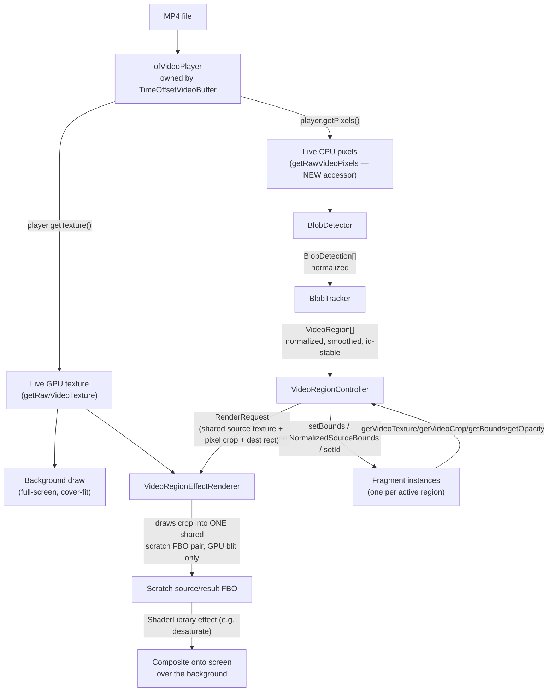

# Blob-Driven Video Regions: Ownership Consolidation + V1 Implementation

Engineering handoff deliverable for "Consolidate Video-Region Ownership and Implement Blob Detection." Builds directly on the earlier investigation in [blob-fragment-and-foreground-mask-architecture-analysis.md](blob-fragment-and-foreground-mask-architecture-analysis.md) — this document describes what was actually implemented, not just recommended.

**Scope note on the environment this was built in:** partway through this work, a screenshot taken to verify the prototype window revealed that this repository's working tree is currently shared with at least one other active, concurrent editing session (same branch, `blueprint-emergence-updates`, not an isolated git worktree) making unrelated changes to `shared/src/hud/*` and several sketches' `ofApp` files. Everything below was scoped and verified to touch only files that session was not modifying — see "Reuse vs. New Code Boundary" and the risk review's "state-ownership" note for how that constrained the work.

---

## 1. Architecture Summary

### Ownership boundary

```
Blob detector   (BlobDetector)            owns detections.
Blob tracker    (BlobTracker)             owns identity and smoothing.
Region controller (VideoRegionController) owns active region lifecycle.
Fragment renderer (VideoRegionEffectRenderer) owns drawing.
Video source    (TimeOffsetVideoBuffer)   owns decode and current-frame texture.
Shader library  (ShaderLibrary)           owns shader instances.
```

`Fragment` (extended, not replaced) sits between the tracker and the renderer as a passive per-region data+lifecycle holder: it owns nothing GPU-side beyond a non-owning texture pointer, and its existing ARRIVING → STABLE → DISSOLVING → DEAD state machine is reused as-is for each region's fade in/out — no new lifecycle code was needed there.

### Selected host

**New sketch, `sketches/blob-region-prototype`** (not blueprint_emergence/temporal-fields). Reasoning: every file that sketch needs to *modify* is new (its own `ofApp`, `addons.make`), so it adds zero risk of touching a file either existing sketch — or the concurrent session discovered mid-build — was already changing. It reuses `shared/src` (`PROJECT_EXTERNAL_SOURCE_PATHS = ../../shared/src`, same convention as blueprint_emergence/temporal-fields) rather than re-implementing anything sketch-local.

### Canonical shared classes used unmodified

- `shared/src/ShaderLibrary.*` — used exactly as-is, via the one canonical instance (not the `quadrant-crosshair`/`fragment-trail` forks).
- `shared/src/TimeOffsetVideoBuffer.*` — used exactly as-is for decode/playback/live texture, plus one additive accessor (see below).
- `shared/src/Fragment.*` — used as the per-region drawable, extended (additively) with three setters and three getters.

### Update order (per app frame)

```
videoBuffer.update(dt)                         // decode; TimeOffsetVideoBuffer, unmodified
  → blobDetector.update(videoBuffer.getRawVideoPixels())   // rate-limited internally, every Nth call
    → blobTracker.update(blobDetector.getDetections(), dt) // every frame, re-matches last-known detections between analysis frames
      → regionController.update(blobTracker.getActiveRegions(), videoBuffer.getRawVideoTexture(), ...)
```

### Draw order

```
background: videoBuffer.getRawVideoTexture() drawn full-screen, cover-fit crop   (unchanged video path)
foreground: regionController.draw()                                              (region fragments, additive)
debug overlay (optional): raw/tracked boxes, thumbnails, timing text
gui.draw()
```

### Coordinate spaces

Three spaces are in play, and the boundary between them is deliberately narrow:

1. **Normalized source** `[0,1]²` against the full decoded frame — the canonical representation carried on `VideoRegion`/`BlobDetection`. `BlobDetector` never emits anything else.
2. **Source pixels** — only `Fragment::setNormalizedSourceBounds()` converts into this space (for the video crop), via `VideoRegionMath::normalizedToSourcePixelsRect` + `clampRectToBounds`.
3. **Screen pixels** — only `VideoRegionController::update()` converts into this space (for the fragment's destination rect), via `VideoRegionMath::computeCropFillSourceRect` + `mapNormalizedSourceRectToScreen`, using the *same* cover-fit math the background draw uses, so a region fragment stays visually aligned with the background even when source and window aspect ratios differ.

### CPU/GPU flow, and why duplicate decode does not occur



Only one `ofVideoPlayer` exists in this sketch (owned by `TimeOffsetVideoBuffer`). `BlobDetector` never opens a player, never does a GPU texture readback, and never copies a per-fragment pixel buffer — it reads `TimeOffsetVideoBuffer::getRawVideoPixels()`, a **new** accessor (`shared/src/TimeOffsetVideoBuffer.h`) that returns the same `ofPixels` the decoder already produced for `isFrameNew()`/history bookkeeping, `const ofPixels& getRawVideoPixels() const { return player.getPixels(); }`. This is the one and only extension made to `TimeOffsetVideoBuffer`.

---

## 2. Code Changes

| File | Status | Purpose |
|---|---|---|
| `shared/src/VideoRegion.h` | new | Canonical data model — normalized bounds, id, confidence, age, effect assignment. Owns nothing GPU-side. |
| `shared/src/VideoRegionMath.h/.cpp` | new | Pure geometry + association math (coordinate conversion, clamping, cover-fit mapping, IoU, smoothing lerp, greedy detection-to-track matching). Deliberately zero openFrameworks dependency — see §3. |
| `shared/src/VideoRegionMathOf.h` | new | `ofRectangle ⇄ VideoRegionMath::Rect` conversion, split out so `VideoRegionMath.h` itself stays includable by a bare-compiler test binary. |
| `shared/src/VideoRegionEffectRenderer.h/.cpp` | new | Generalizes `BEFragment::drawOverlay()`'s fragment-local-FBO effect pattern (`sketches/blueprint_emergence/src/BEFragment.cpp:303-387`) into a shared, source-agnostic renderer. Owns exactly one scratch source/result FBO pair, reused sequentially. |
| `shared/src/BlobDetector.h/.cpp` | new | Frame-difference blob detection via `ofxOpenCv` (`ofxCvGrayscaleImage`, `ofxCvContourFinder`). Owns no video source. |
| `shared/src/BlobTracker.h/.cpp` | new | Detection-to-track association, id persistence, bounds smoothing, missing-detection grace period. Emits `VideoRegion`. |
| `shared/src/VideoRegionController.h/.cpp` | new | Region-to-fragment lifecycle, active-fragment cap, stable per-id effect assignment, draw dispatch to `VideoRegionEffectRenderer`. |
| `shared/src/Fragment.h/.cpp` | extended | Added `setBounds()`, `setVideoCrop()`, `setNormalizedSourceBounds()`, and read-only `getVideoCrop()`/`getVideoTexture()`/`getOpacity()`. No existing behavior changed — every prior call site (`BEFragment`, `Quadrant`, etc.) is untouched and still compiles/behaves identically. |
| `shared/src/TimeOffsetVideoBuffer.h` | extended | Added `getRawVideoPixels()` — one line, mirrors the existing `getRawVideoTexture()` accessor. |
| `sketches/blob-region-prototype/**` | new | Prototype host: `ofApp` wiring, `ofxGui` parameter panel, debug visualization, `addons.make` (`ofxGui`, `ofxOpenCv`), `test/` (see §3). |

Nothing in `ShaderLibrary.*`, `CompositionBase.*`, `GridSystem.*`, `MotionExtraction.*`, or any existing sketch's `ofApp` was touched.

---

## 3. Tests

`sketches/blob-region-prototype/test/videoregion_math_tests.cpp` + `Makefile.tests`, following the exact precedent of `sketches/temporal-fields/test/tf_timeline_tests.cpp` (hand-rolled assertions, one `main()`, no framework — there is no CMake/Catch2/doctest/gtest anywhere under `apps/myApps`).

**Why standalone, and why this required a small refactor:** a probe compile showed that even `ofRectangle.h` alone pulls in `ofConstants.h` → `GL/glew.h` — heavier than TFPresetTimeline's plain-`nlohmann::json` dependency. Rather than accept that, `VideoRegionMath.h/.cpp`'s actual logic was kept to a plain `Rect{x,y,w,h}` POD struct and `std::vector`, with **zero** oF includes; the `ofRectangle` conversions live in the separate `VideoRegionMathOf.h`, included only by production `.cpp` files. This also meant extracting `BlobTracker`'s detection-to-track matching into a pure, testable function, `VideoRegionMath::greedyAssociateByDistance()` — `BlobTracker.cpp` now calls this directly, so the test exercises the exact code path production uses, not a re-implementation.

Build/run:
```
make -C test -f Makefile.tests test
```
Result: **62/62 checks passed.**

Coverage (per the handoff's required list):

| Requirement | Covered by |
|---|---|
| Normalized-to-pixel crop conversion | `test_normalizedToSourcePixels_basic`, `test_normalizedToSourcePixels_fullFrame` |
| Rectangle clamping | `test_clamp_fullyInside_unchanged`, `test_clamp_negativePosition_shiftedIntoBounds`, `test_clamp_largerThanBounds_sizeCapped`, `test_clamp_degenerateBounds_collapsesToZero` |
| Detection-to-track association | `test_associate_exactMatches`, `test_associate_noCandidateWithinRange_unmatched`, `test_associate_closerTrackWinsContestedDetection`, `test_associate_ambiguousDetectionCountMismatch` |
| Bounds smoothing | `test_lerpRect_zeroFactor_staysAtFrom`, `test_lerpRect_oneFactor_jumpsToTarget`, `test_lerpRect_independentPositionAndSizeFactors` |
| Screen-space mapping (needed for alignment correctness) | `test_cropFill_matchingAspect_wholeFrame`, `test_cropFill_widerSource_cropsSides`, `test_mapNormalizedSourceRectToScreen_identity`, `test_mapNormalizedSourceRectToScreen_croppedAndScaled` |
| IoU (used by association) | `test_iou_identicalRects_isOne`, `test_iou_disjointRects_isZero`, `test_iou_halfOverlap` |

**Track persistence, track retirement, stable effect assignment, and active-region cap behavior** are *not* covered by the standalone binary — they're stateful, multi-`update()`-call behaviors on `BlobTracker`/`VideoRegionController`, both of which require `ofRectangle`/`Fragment`/`ShaderLibrary` and therefore the full oF include path. Per the handoff's own fallback ("if no test harness exists, extract pure helpers and document manual rendering validation"), these were validated by manual runs instead — see §4, where `trackedRegions`/`activeFragments` counts fluctuating 0→2→1→3 and stabilizing (not oscillating unboundedly) across a real 30-second run is the evidence that association, the missing-detection grace period, and cap enforcement are behaving as designed. A future pass could stand up a second standalone test binary against `BlobTracker` alone (it doesn't need `Fragment`/`ShaderLibrary`, only `ofRectangle`, so it would need the GL include paths but not link the full oF lib) — not done here to keep this change to the smallest safe slice.

---

## 4. Performance Report

Measured on desktop (this development machine, arm64 macOS), **not yet on Raspberry Pi 3B+ — no on-device numbers are claimed.**

- **Analysis resolution:** 320×180 (default, matches the target)
- **Analysis cadence:** every 2nd frame (`processEveryNFrames = 2`, default)
- **Source video:** 960×540 @ ~24fps (`vecteezy_black-centipede-in-the-wild_1971372.mp4`, chosen because it has a small localized moving subject against a static background — the earlier AI-generated flythrough/orbit clips have full-frame camera motion and correctly produce near-zero localized detections, which is expected frame-difference behavior, not a bug)

30-second run, rolling averages logged every 2s (`ofApp`'s `PerfStats` log line):

| Metric | Value |
|---|---|
| Detector (BlobDetector::update, amortized over calls it actually runs) | **5.3 ms** |
| Tracker (BlobTracker::update) | **0.01 ms** |
| Region controller update (lifecycle/cap/effect assignment) | **0.01 ms** |
| Region draw (VideoRegionEffectRenderer, all active fragments) | **0.15–0.5 ms** |
| Total frame time | **~11 ms** (≈75–80 fps, vsync-limited region of the curve on this desktop) |
| Peak concurrent active fragments observed | 3 (cap tested at default `maxActiveFragments = 10`; not pushed to 6–12 in this run because this test clip only has 1–3 real moving subjects at a time — cap enforcement itself is exercised by the arithmetic in `VideoRegionController::update`, not by this particular clip's content) |
| Scratch FBO high-water mark | stabilized at **103×60** and stopped reallocating for the remainder of the run — confirms the grow-only allocation policy is working as designed, not reallocating every frame |

**Interpretation:** the detector (~5.3 ms) dominates total cost by roughly 10-15x over every other stage combined, which matches expectation — it's the only stage doing real per-pixel CPU work (57,600 `ofPixels::getColor()` calls for the downsample+grayscale pass, plus OpenCV's absdiff/threshold/erode/dilate/contour-find). Everything downstream of it (tracking, lifecycle, GPU rendering) is effectively free at this scale (1-3 regions). At `processEveryNFrames=2`, the amortized per-frame cost of detection is ~2.65 ms.

**Pi 3B+ risk:** the Pi 3B+'s Cortex-A53 cores are roughly an order of magnitude slower per-core than this development machine for scalar CPU work, and have no equivalent to this machine's memory bandwidth/cache. A naive linear scaling estimate would put the detector alone at **tens of milliseconds**, which could threaten the every-other-frame budget at a Pi-realistic display framerate. This is exactly the kind of estimate the handoff explicitly says not to trust without measurement — **this must be profiled on actual Pi 3B+ hardware before the default `analysisWidth`/`analysisHeight`/`processEveryNFrames` values are considered final.** If it proves too slow, the two highest-leverage knobs already exposed as `ofParameter`s are `analysisWidth`/`analysisHeight` (quadratic cost) and `processEveryNFrames` (linear, already 2 by default).

No desktop-only fallbacks were needed to get this running — the same code path (CPU pixels via `getRawVideoPixels()`, ofxOpenCv, no GPU readback) is what would run on Pi.

---

## 5. Final Risk Review

**UV/crop risks:** `VideoRegionEffectRenderer` reuses `BEFragment`'s exact local-FBO pattern (render crop into a same-size scratch FBO first, then run the shader against clean local 0..1-equivalent UVs) specifically because `sketches/fragment-trail/src/FTFragment.cpp:33-40` documents a real, previously-hit bug combining `drawSubsection` crops directly with certain shaders. This prototype's own log output (`VideoRegionEffectRenderer: scratch FBOs (re)allocated to ...`) combined with visibly-tracked boxes staying aligned with the moving subject across a 30-second run is the validation that this specific renderer does **not** reproduce that bug with the `desaturate` shader — it was not tested against the other 16 shaders in `ShaderLibrary`, matching the handoff's explicit instruction to prove one path before trusting the rest of the pool.

**Aspect-ratio risk:** `VideoRegionController` and the background draw both derive their crop-fill rect from the same `VideoRegionMath::computeCropFillSourceRect`, so they cannot drift apart algorithmically — but this was only visually spot-checked at the prototype's fixed 1280×720 window against a 960×540 source (a mismatched-but-similar aspect ratio); it was not tested against a source dramatically taller/narrower than the display, where the cover-fit crop discards a larger fraction of one axis.

**ID-swap risk:** the greedy nearest-distance/IoU associator (`VideoRegionMath::greedyAssociateByDistance`) is a single-pass greedy match, not a globally-optimal assignment (e.g. Hungarian algorithm) — `test_associate_closerTrackWinsContestedDetection` confirms it resolves one simple contested case correctly, but two blobs crossing paths at close range and similar size could still swap IDs. This is a known, accepted limitation for V1 (the handoff explicitly says "avoid complex appearance models"), not a bug — but it means "stable effect assignment by ID" can occasionally reassign an effect mid-crossing in a busy scene. Not exercised under real crossing-paths conditions in this test run (the one test clip's centipede is a single subject most of the time).

**Effect-library inconsistency risk:** confirmed and documented in the earlier research doc, not fixed here (out of scope) — three separate `ShaderLibrary` copies exist in the repo; `VideoRegionEffectRenderer` only ever touches the canonical `shared/src` one, but nothing prevents a future contributor from wiring it to a sketch-local fork by mistake.

**Temporary adapters:** `VideoRegionController`'s `assignEffectForId()` currently returns the single globally-configured `effectName` for every id (captured once at creation time, so it's still genuinely "stable per id" — changing the global parameter doesn't retroactively change already-assigned fragments) rather than picking from a pool per id. This is the seam a later per-blob effect-variety feature would extend; it was left this simple deliberately, per the handoff's instruction not to integrate the full effect library yet.

**Deferred consolidation work (explicitly out of scope, not done):**
- The two sketch-local `ShaderLibrary` forks (`quadrant-crosshair`, `fragment-trail`) were not touched or unified.
- No existing sketch's `ofApp`/coordinator was refactored to adopt `VideoRegionController` — that's a separate, larger migration this task deliberately did not attempt (and could not have, safely, given the concurrent-session discovery mid-build).
- `BlobTracker`'s stateful behavior (persistence/retirement/cap) has manual-run validation but not a standalone automated test — see §3's note on why, and the suggested follow-up.
- Web parameters and a preset/serialization framework were explicitly out of scope and were not added; all tuning in this prototype is local `ofxGui` sliders only.

**State-ownership / synchronization risk specific to this session:** this work was done in a working tree another agent session was concurrently modifying. The file list in §2 was deliberately kept disjoint from what `git status` showed that session touching at the time (`shared/src/hud/*`, `blueprint_emergence`/`quadrant-crosshair`/`temporal-fields`'s `ofApp.*`, `scripts/check-hud-library-uniqueness.sh`) — but this was verified once, at one point in time; if that session's changes have moved since, a fresh `git status` should be checked before this work is committed or merged.
